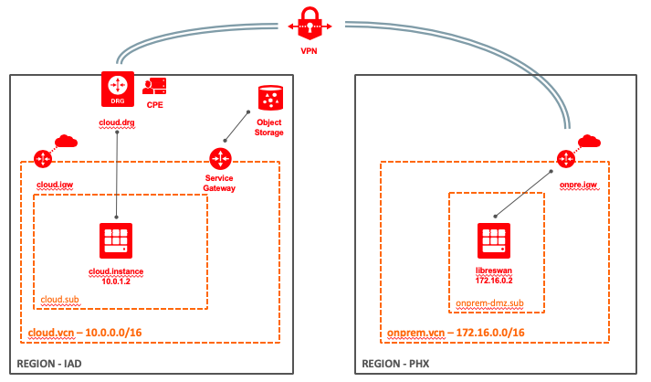

# OCI - VPN Lab  with Transit Routing 

Terraform script to setup a VPN lab on OCI with transit routing enabled
It creates a fully functional 2-tunnels IPSec VPN between OCI VPN Service (cloud) and libreswan based compute instance (onprem).




## Setup 

Create terraform.tfvars file 

```shell
cp terraform.tfvars_template terraform.tfvars
```

Edit terraform.tfvars, replacing _\_\_placeholders\_\__ with your configuration values 

```shell
terraform init
terraform plan
terraform apply
```